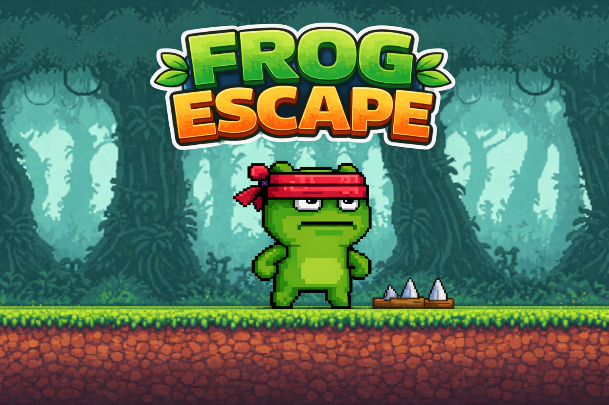

# Frog Escape - GDD

## 1. Información general
- **Nombre del juego:** Frog Escape
- **Género:** Endless Runner / Plataformas 2D
- **Plataforma:** PC
- **Motor de desarrollo:** Godot Engine
- **Duración de la partida:** Llegar a 10000 puntos

## 2. Concepto del juego
Frog Escape es un juego en 2D de tipo endless runner en el que el jugador controla un personaje que corre automáticamente hacia adelante.  
El objetivo es esquivar los obstáculos que aparecen en pantalla mediante saltos, intentando sobrevivir el mayor tiempo posible y poder llegar a 10.000 puntos.  

El juego está inspirado en mecánicas simples y accesibles, permitiendo partidas rápidas y rejugables.

## 3. Mecánicas principales
- El personaje se mueve automáticamente hacia adelante (no control lateral).  
- El jugador solo puede saltar.
- Los obstáculos aparecen de forma continua desde la derecha de la pantalla.  
- La velocidad del juego va aumentando.  
- Al colisionar con un obstáculo, el juego termina y se muestra la opción de reiniciar la partida mediante un botón.

## 4. Controles
- **Tecla Espacio / Flecha Arriba / W / Click Izquierdo:** Saltar  

Los controles son simples para facilitar la jugabilidad y permitir partidas rápidas.

## 5. Personaje
- Personaje principal controlado por el jugador.  
- Permanece en una posición fija horizontalmente.  
- Puede saltar para esquivar obstáculos bajos.
- Tiene una colisión activa para detectar impactos.

## 6. Obstáculos
- Aparecen de forma aleatoria desde el lado derecho de la pantalla.  
- Se desplazan hacia la izquierda simulando el movimiento del personaje.  
- Tipos de obstáculos:  
  - Obstáculos bajos - Pinchos (requieren salto)  
  - Obstáculos altos - Sierras giratorias (puede chocar al saltar).
- Se eliminan automáticamente al salir de la pantalla.

## 7. Sistema de puntuación
- La puntuación aumenta automáticamente con el tiempo.  
- Cuanto más tiempo sobreviva el jugador, mayor será la puntuación.  
- La puntuación se muestra en pantalla en todo momento.

## 8. Condición de derrota
- El jugador pierde al colisionar con un obstáculo.  
- Al perder, el juego se detiene y se muestra un botón de “Reiniciar”.  
- Al pulsar el botón, la partida comienza de nuevo hasta pulsar la barra espaciadora.

## 9. Interfaz de usuario (UI)
- Contador de puntuación visible en pantalla.  
- Mensaje de "Game Over" y un botón de “Reiniciar” al perder partida.  
- Mensaje de "Has ganado" y un botón de "Volver a jugar" al ganar una partida.
- Interfaz simple y clara.

## 10. Estilo visual
- Gráficos en 2D simples.  
- Diseño minimalista para facilitar el desarrollo.  
- Personaje y obstáculos con formas básicas o sprites sencillos.  
- Fondo con movimiento ligero.

## 11. Sonido
- Efecto de sonido al saltar.  
- Efecto de sonido al colisionar (Game Over).
- Efecto de sonido al ganar.

## 12. Estructura técnica básica
- Escena principal (`frog_escape`)  
- Escena del jugador (`frog`)  
- Escena de obstáculos (`saw` / `spikes`)  
- Escena del paisaje de fondo (`jungle_map`)
- Escenas para los menus (`game_over` / `hud` / `win`)
- Sistema de puntuación

## 13. Objetivo del proyecto
Desarrollar un juego sencillo en Godot Engine para aprender las bases del desarrollo de videojuegos, incluyendo:  
- Movimiento de personaje
- Detección de colisiones  
- Generación de objetos  
- Gestión de escenas  
- Interfaz básica

## 14. Posibles mejoras futuras
- Mayor variedad de obstáculos.
- Sistema de récord (high score). 
- Música de fondo.
- Doble salto para los objetos mas altos.

## 15. Recursos
- **Imágenes de personajes, suelo y obstáculos:** *Pixel Adventure 1* – assets de Pixel Frog, disponibles en [itch.io](https://pixelfrog-assets.itch.io/pixel-adventure-1), con licencia según la página del autor.
- **Imagen para el fondo:** *Jungle Pack* - assets de Jesse M, disponibles en [jesse-m.itch.io](https://jesse-m.itch.io/jungle-pack)
- **Fuente:** *Retro Gaming Font* - disponible en [dafont.com](https://www.dafont.com/retro-gaming.font)
- **Sonidos:** *Google Dinosaur Run Game* - disponible en [sounds.spriters-resource.com](https://sounds.spriters-resource.com/browser_games/googledinosaurrungame/asset/411530/)
